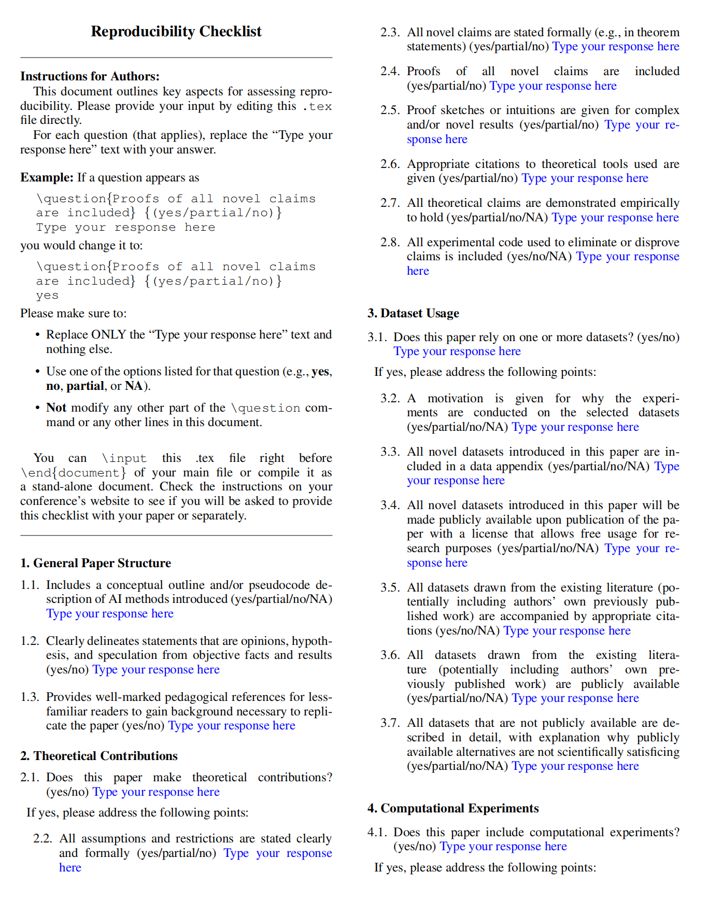
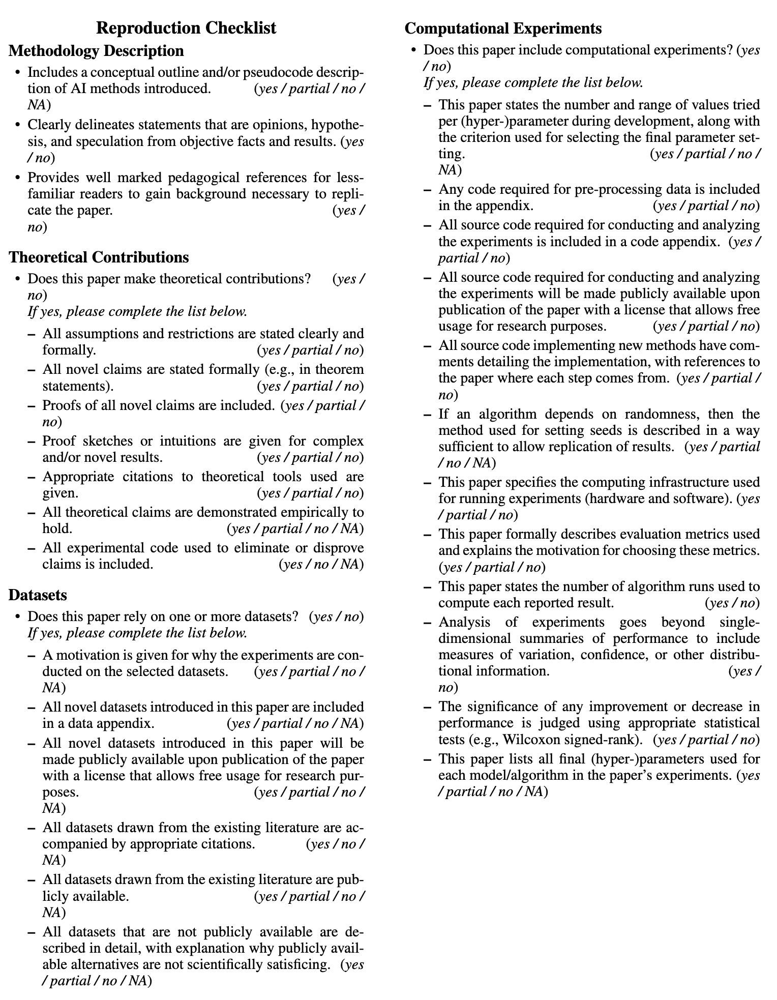

<div align="right">
<a href="README_CN.md"></a>
</div>

# ✍️ AAAI-26 Submission Final Checklist
We open-sourced [a final checklist](final-checklist.md) of AAAI-26 submissions. Hope this might do you a great favor! Wish you all the best with your AAAI-26 submissions! 💪

# ⚠️ IMPORTANT UPDATE: Note that AAAI has updated the official LaTeX template for the reproduction checklist, please refer to [https://aaai.org/conference/aaai/aaai-26/main-technical-track-call/](https://aaai.org/conference/aaai/aaai-26/main-technical-track-call/) to download the *AAAI-26 Author Kit*, where the template is under the folder named *ReproducibilityChecklist*. You can also refer to the copied files under the `official-template` folder.

The official checklist should be looked like:


# 🤖 AAAI-26 Reproduction Checklist Template

This repository provides a LaTeX template for the AAAI-26 Reproduction Checklist, as is saved under the `old` folder.

## 📝 AAAI-26 Submission Policy

> Unless specified otherwise, please answer “yes” to each question if the relevant information is described either in the paper itself or in a technical appendix with an explicit reference from the main paper. If you wish to explain an answer further, please do so in a section titled “Reproducibility Checklist” at the end of the technical appendix.

## 🚀 Usage

1.  Clone or download this repository.
2.  Answer each question in the `template.tex` file based on your submission.
3.  Compile the LaTeX file to generate the PDF checklist:
    ```bash
    pdflatex old/template.tex
    ```
4.  The rendered result should look like this:

    

Alternatively, you can just copy and paste the content of `template.tex` into your main LaTeX project.

## ❤️ Support

If you find this repository helpful for your submission, please give us a ⭐️! Your support encourages us to share more open-source resources.

**Good luck with your submission! 🎉**