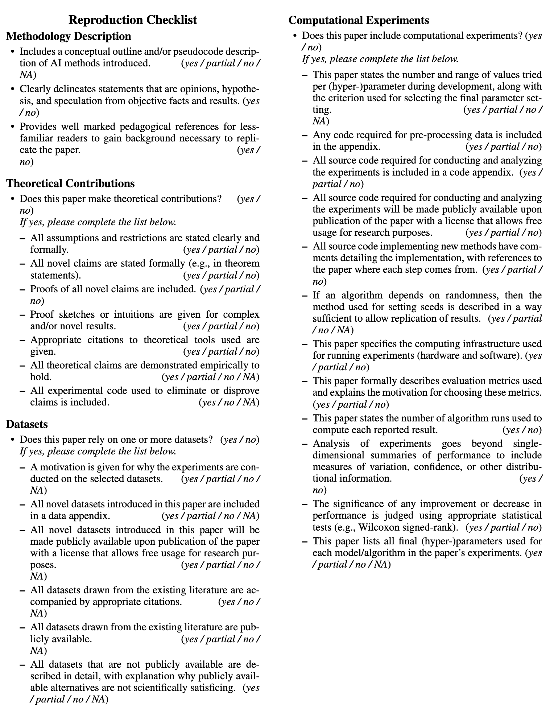

<div align="right">
<a href="README.md"></a>
</div>

# ⚠️ AAAI已经更新了官方模板，可以移步[https://aaai.org/conference/aaai/aaai-26/main-technical-track-call/](https://aaai.org/conference/aaai/aaai-26/main-technical-track-call/)，通过「AAAI-26 Author Kit」下载，在压缩包的「ReproducibilityChecklist」中。

# 🤖 AAAI-26 可复现性清单模板

本仓库为 AAAI-26 可复现性清单提供了一个 LaTeX 模板。

## 📝 AAAI-26 提交政策

> 除另有规定外，如果相关信息在论文本身或在论文正文明确引用的技术附录中有所描述，请对每个问题回答“是”。如果您希望进一步解释某个答案，请在技术附录末尾题为“可复现性清单”的部分中进行说明。

## 🚀 使用方法

1.  克隆或下载本仓库。
2.  根据您提交的内容，在 `template.tex` 文件中回答每个问题。
3.  编译 LaTeX 文件以生成 PDF 清单：
    ```bash
    pdflatex template.tex
    ```
4.  渲染结果应如下所示：

    

此外，您也可以直接将 `template.tex` 的内容复制并粘贴到您的主 LaTeX 项目中。

## ❤️ 支持

如果您觉得本仓库对您的提交有帮助，请给我们点一个 ⭐️！您的支持将鼓励我们分享更多的开源资源。

**祝您科研顺利！🎉** 